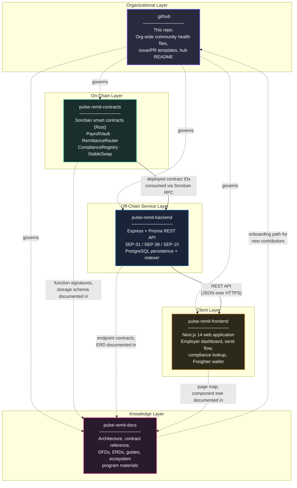
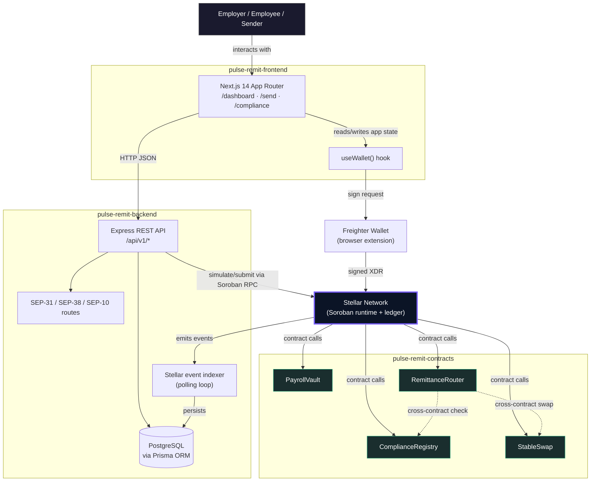
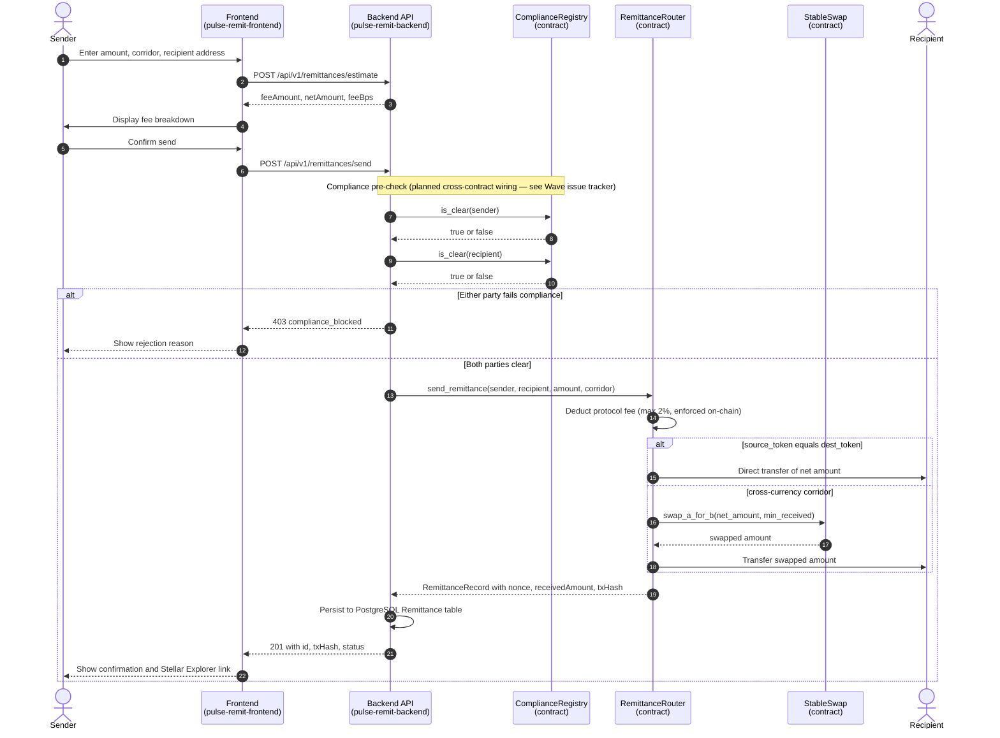
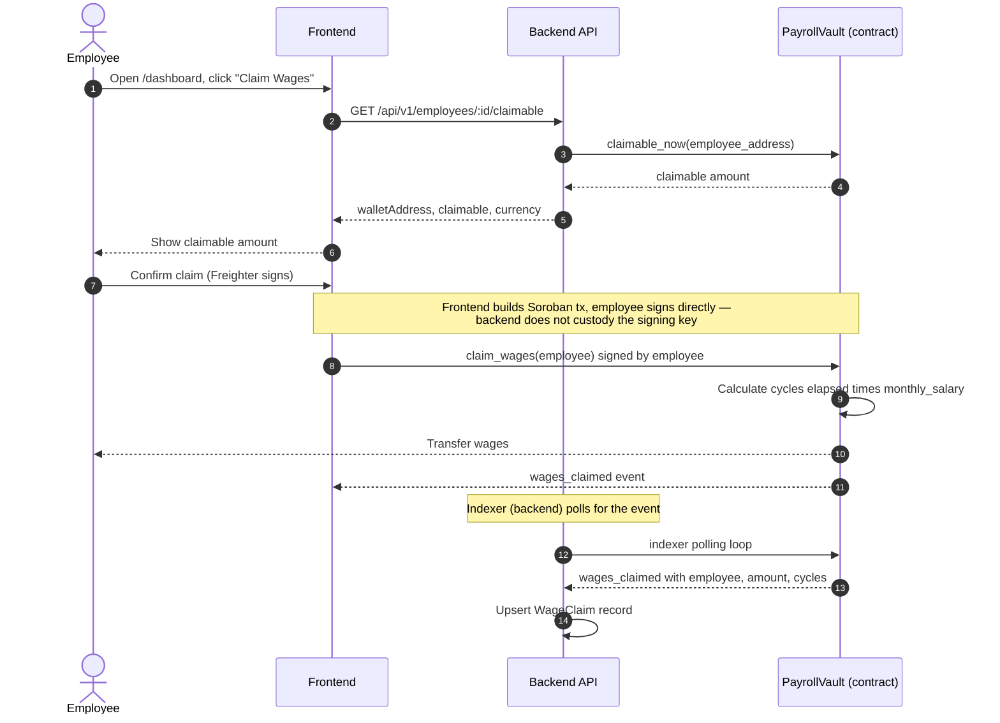
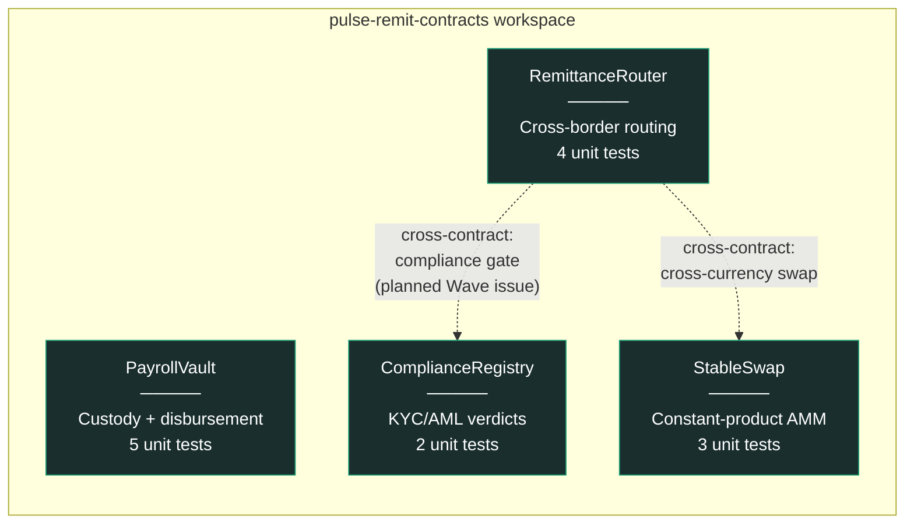
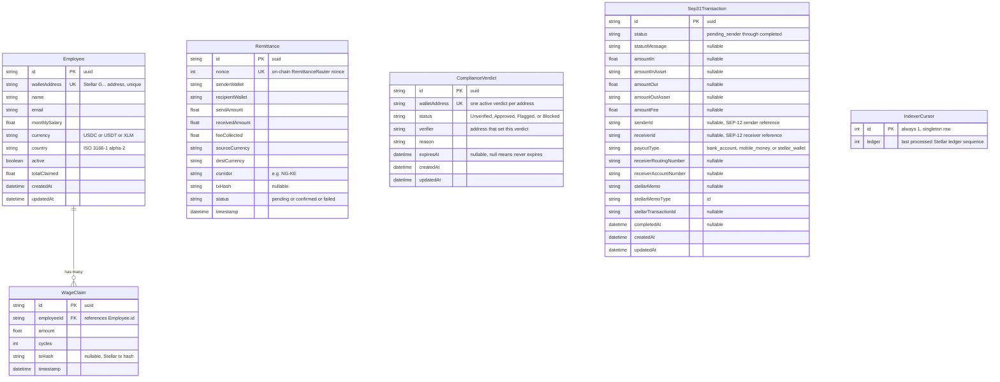
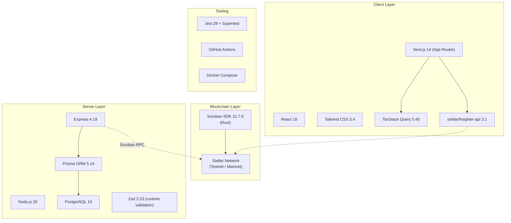

# PulseRemit

### Cross-Border Payroll & Remittance Infrastructure on Stellar

[](./LICENSE)
[](https://soroban.stellar.org)
[](https://github.com/stellar/stellar-protocol/blob/master/ecosystem/sep-0031.md)
[](https://github.com/stellar/stellar-protocol/blob/master/ecosystem/sep-0038.md)
[](https://github.com/stellar/stellar-protocol/blob/master/ecosystem/sep-0010.md)
[](#3-repository-constellation)

**This is the `.github` repository.** It is the organizational hub for the PulseRemit project — a five-repository system implementing non-custodial, cross-border payroll and remittance rails on the Stellar network. This document is the canonical entry point: it defines the full scope of the project, how the five repositories relate to one another, and how the project as a whole contributes to the Stellar network.

If you are looking for a specific repository's setup instructions, jump to [§3](#3-repository-constellation) for direct links. If you are trying to understand *why* this project exists and what problem it solves, keep reading from the top.

---

## Table of Contents

1. [What This Project Is](#1-what-this-project-is)
2. [The Problem: Why Cross-Border Payroll Is Broken](#2-the-problem-why-cross-border-payroll-is-broken)
3. [Repository Constellation](#3-repository-constellation)
4. [System Architecture](#4-system-architecture)
5. [End-to-End Data Flow](#5-end-to-end-data-flow)
6. [Contract Layer Summary](#6-contract-layer-summary)
7. [Data Model Summary](#7-data-model-summary)
8. [Stellar Ecosystem Standards Compliance](#8-stellar-ecosystem-standards-compliance)
9. [How This Project Contributes to the Stellar Network](#9-how-this-project-contributes-to-the-stellar-network)
10. [Technology Stack](#10-technology-stack)
11. [Getting Started (Full Stack)](#11-getting-started-full-stack)
12. [Repository Governance](#12-repository-governance)
13. [Community Health Files](#13-community-health-files)
14. [Versioning and Release Policy](#14-versioning-and-release-policy)
15. [Security](#15-security)
16. [Roadmap](#16-roadmap)
17. [Maintainers](#17-maintainers)
18. [License](#18-license)

---

## 1. What This Project Is

PulseRemit is infrastructure for moving money across borders using the Stellar network as the settlement layer, instead of the correspondent banking system. Concretely, it does two things:

- **Payroll**: an employer funds an on-chain vault once; employees in different countries claim their own wages directly from that vault on their own schedule, in USDC, without the employer initiating a transfer for every single payday.
- **Remittance**: a person in one country sends value to a person in another country, with the fee, the exchange rate, and the settlement all happening transparently on a public ledger instead of inside a bank's back office.

Both flows are built on **Soroban**, Stellar's smart contract platform, and both are wired into the **Stellar Ecosystem Proposals (SEPs)** — the standards that let independent wallets, exchanges, and payment processors interoperate on Stellar without bespoke integrations. That distinction matters: this is not a payments app that happens to use crypto as a backend. It is built to plug into the same interoperability layer that Stellar's anchor network already uses, so that any SEP-31-compliant sending institution can route a payment through it without custom code.

The project is deliberately split into five repositories rather than shipped as one. That decision, and what each repository is responsible for, is covered in [§3](#3-repository-constellation).

---

## 2. The Problem: Why Cross-Border Payroll Is Broken

A worker in Lagos employed by a company in London is paid through a chain that typically looks like this: the employer's bank debits GBP, a correspondent bank in the chain converts it, SWIFT messages coordinate the handoff, a receiving bank in Nigeria credits a Naira-denominated account — and at every hop, a fee is taken and the transaction is delayed. The World Bank's Remittance Prices Worldwide database has tracked average global remittance costs sitting stubbornly around 6–7% of the transfer amount for over a decade, more than double the UN Sustainable Development Goal target of 3%. For a worker sending $200 home, that is $12–14 gone before it arrives, on top of a settlement time measured in days, not seconds.

The structural reason this hasn't improved is that the correspondent banking network was designed for institutional transfers between banks that already trust each other, not for high-frequency, low-value, cross-border retail payments. Every additional intermediary bank in the chain adds a fee and a delay; there is no way to "skip" hops in a system built entirely out of bilateral relationships.

Stellar's core design — the Stellar Consensus Protocol enabling settlement in 3–5 seconds at a cost measured in fractions of a cent — exists specifically to remove those intermediary hops. PulseRemit is one concrete implementation of what that removal looks like in a real payroll and remittance context: employer funds a vault once, employees claim directly, cross-border transfers settle in seconds against transparent, capped fees, and everything is auditable on a public ledger instead of trapped inside separate banks' private systems.

---

## 3. Repository Constellation

The project is split into five repositories, each with a single, well-defined responsibility. This diagram shows how they relate:



### Why five repositories instead of one

| Reason | Explanation |
|---|---|
| **Independent release cycles** | The contracts repo changes rarely and every change requires a security-conscious review plus testnet redeployment. The frontend can ship UI fixes hourly. Coupling them in one repo forces one release cadence on both. |
| **Independent CI** | A contract-only change should not have to wait on a Next.js build, and vice versa. Each repo's CI (see each repo's `.github/workflows/ci.yml`) only runs what's relevant to it. |
| **Clear audit boundary** | Auditors reviewing the on-chain contracts should not need to wade through frontend React components to find the code that actually moves funds. |
| **Focused contribution** | A technical writer fixing documentation, a frontend developer improving accessibility, and a Rust engineer implementing a cross-contract call are three different audiences. Five repos let each contribute without touching code outside their domain. |
| **Standard practice at scale** | This mirrors how most production blockchain projects are organized — a project's core protocol contracts, its SDK/backend, its dApp frontend, and its documentation portal are conventionally separate repositories, often under one GitHub organization with a shared `.github` repo exactly like this one. |

### Direct links

| Repository | Purpose | Primary Language |
|---|---|---|
| [`pulse-remit-contracts`](https://github.com/YOUR_ORG/pulse-remit-contracts) | Soroban smart contracts | Rust |
| [`pulse-remit-backend`](https://github.com/YOUR_ORG/pulse-remit-backend) | REST API, SEP compliance, indexer | TypeScript (Node.js) |
| [`pulse-remit-frontend`](https://github.com/YOUR_ORG/pulse-remit-frontend) | Web application | TypeScript (Next.js) |
| [`pulse-remit-docs`](https://github.com/YOUR_ORG/pulse-remit-docs) | Architecture, references, guides | Markdown |
| `.github` | This repository — org governance | Markdown / YAML |

---

## 4. System Architecture

This is the complete system, spanning all five repositories, showing how a request moves from a person's browser down to the Stellar ledger and back.



### Layer responsibilities at a glance

| Layer | Repository | Owns | Does NOT own |
|---|---|---|---|
| Presentation | `pulse-remit-frontend` | UI state, wallet connection, form validation | Business rules, fee calculation logic, persistence |
| Application | `pulse-remit-backend` | REST API, SEP compliance surfaces, off-chain persistence, event indexing | Custody of funds, consensus, source of truth for balances |
| Settlement | `pulse-remit-contracts` | Fund custody, fee enforcement, compliance gating, atomic execution | UI rendering, HTTP semantics, database schema |
| Reference | `pulse-remit-docs` | Explaining the other three layers accurately | Executable code |
| Governance | `.github` | Contribution process, issue/PR templates, security policy | Any of the above |

A backend outage does not put funds at risk — the contracts remain the source of truth for balances and the compliance gate. A frontend outage does not stop existing payroll claims from being claimable — a user could, in principle, invoke the contract directly via the Stellar CLI. This separation of concerns is intentional and is the same design principle that makes the Stellar network itself resilient: no single off-chain component is a single point of failure for custody.

---

## 5. End-to-End Data Flow

The following sequence diagram traces one complete remittance from initiation to settlement, showing exactly which repository owns each step.



### Corresponding payroll claim flow



---

## 6. Contract Layer Summary

Four Soroban contracts, deployed independently, composed together at the application layer. Full function-by-function reference lives in `pulse-remit-contracts/README.md` and `pulse-remit-docs/contracts/contract-reference.md`.



| Contract | Responsibility | Test Count | Key Invariant |
|---|---|---|---|
| `PayrollVault` | Holds employer-funded balances; employees self-claim on schedule | 5 | Cannot disburse more than `monthly_salary × cycles_elapsed` per employee |
| `RemittanceRouter` | Routes payments between parties, deducts protocol fee, handles cross-currency via registered pools | 4 | Protocol fee is hard-capped at 200 basis points (2%), enforced in `initialize()` and `update_fee()` |
| `ComplianceRegistry` | Stores KYC/AML verdicts set by whitelisted verifiers | 2 | Only whitelisted verifier addresses can call `set_verdict()` |
| `StableSwap` | Constant-product (x·y=k) AMM pool for corridor liquidity | 3 | Liquidity removal cannot bypass the constant-product invariant |

**A note on architectural honesty**: Soroban contracts cannot call into the Stellar classic DEX, order book, or path payment operations — this is a platform-level constraint, not a design choice made by this project. `RemittanceRouter` therefore routes cross-currency corridors exclusively through registered Soroban AMM pool contracts (such as `StableSwap`), never through the SDEX. This constraint is documented directly in the contract source so it cannot be silently reintroduced by a future contributor.

---

## 7. Data Model Summary

The backend's persistence layer, expressed as an entity-relationship diagram with primary and foreign keys marked explicitly. This is the authoritative relational shape of everything the off-chain service layer tracks; the full Prisma schema lives in `pulse-remit-backend/prisma/schema.prisma`.



### Design notes on the data model

- **`Employee.walletAddress` is unique** — one Stellar address maps to exactly one employee record. This mirrors the on-chain `PayrollVault` contract, which keys employee records by `Address` in its own storage.
- **`Remittance.nonce` is unique** — it mirrors the monotonically increasing nonce assigned by `RemittanceRouter.send_remittance()` on-chain, giving every off-chain row a verifiable on-chain counterpart.
- **`ComplianceVerdict` has no direct foreign key into `Employee` or `Remittance`** — this is intentional. Compliance verdicts are keyed by wallet address, not by domain entity, because the same address might be a sender in one remittance and an employee in a payroll relationship; compliance status is a property of the address, not of a specific business relationship.
- **`IndexerCursor` is a singleton table** (`id` is always `1`) — this is the standard at-least-once-delivery pattern for blockchain event indexers: the cursor persists the last successfully processed ledger so a restarted indexer resumes rather than re-scanning from genesis or silently skipping events.

---

## 8. Stellar Ecosystem Standards Compliance

PulseRemit implements three Stellar Ecosystem Proposals (SEPs), which are the standards that let independently-operated Stellar services interoperate without bilateral integration agreements — the same role that ISO 20022 or SWIFT MT messages play in traditional finance, but open and permissionless.

| SEP | Name | What It Standardizes | Where It's Implemented |
|---|---|---|---|
| SEP-1 | `stellar.toml` | Service discovery — lets any client find this anchor's endpoints, supported currencies, and signing key from a well-known URL | `pulse-remit-backend/public/.well-known/stellar.toml` |
| SEP-10 | Stellar Web Authentication | Proves a client controls a Stellar keypair without ever transmitting the private key, via a signed challenge transaction | `pulse-remit-backend/src/routes/auth.routes.ts` |
| SEP-31 | Cross-Border Payments API | Standardizes how one financial institution hands off a payment to another institution's receive-side rails | `pulse-remit-backend/src/routes/sep31.routes.ts` |
| SEP-38 | Anchor RFQ (Quote) API | Standardizes how a sending party requests a firm, time-limited exchange rate before committing to a transfer | `pulse-remit-backend/src/routes/sep38.routes.ts` |

Implementing these standards — rather than a bespoke REST API that only this project's own frontend understands — is what separates "an app that uses Stellar" from "infrastructure the Stellar ecosystem can build on." Any SEP-31-compliant sending institution (a wallet, an exchange, another anchor) can integrate with PulseRemit's receive side using code they may have already written to talk to other Stellar anchors.

---

## 9. How This Project Contributes to the Stellar Network

This section speaks in general terms about ecosystem contribution — not about any specific grant or contributor program — because the value described here is intended to hold regardless of which program, if any, is evaluating it.

### 9.1 It exercises a use case Stellar was built for

Stellar's founding design goal, as described in its original consensus paper, was closing the gap between the world's disconnected financial systems — explicitly citing the excessive cost and friction of moving money across borders for underserved populations. PulseRemit is a direct, working instance of that goal: real payroll disbursement and real remittance routing, denominated in a stable asset, settling in seconds, with fees capped and enforced at the protocol level rather than left to institutional discretion.

### 9.2 It adds composable financial primitives to the ecosystem

`StableSwap` is a general-purpose constant-product AMM pool, not something hardcoded to only work inside `RemittanceRouter`. Any other Soroban contract that needs a liquidity pool for a stable-asset pair can register with and route through it. This is the same compounding effect that made early Ethereum DeFi primitives — constant-product AMMs, in particular — valuable well beyond their original application: a working, tested implementation lowers the cost for the next builder who needs the same primitive.

### 9.3 It demonstrates real interoperability, not just Soroban usage

Many smart-contract projects on any chain stop at "the contract works." PulseRemit's backend implements SEP-31, SEP-38, and SEP-10 — meaning the project is reachable by the existing Stellar anchor ecosystem via standards those anchors already speak, rather than requiring every counterparty to learn a project-specific API. This is a meaningfully higher bar than a contract deployed in isolation, and it is the kind of interoperability the SEP process exists to encourage across the entire network, not just within one application.

### 9.4 It produces reusable reference material

The `pulse-remit-docs` repository documents, in detail, the actual cross-contract call patterns, the actual data flow, and the actual constraints encountered while building on Soroban — including the SDEX-access limitation described in [§6](#6-contract-layer-summary). Documentation of real, encountered constraints, not just happy-path tutorials, has direct value to the next team building payment infrastructure on Stellar, reducing the time they spend rediscovering the same platform boundaries.

### 9.5 It is structured for community contribution, not just personal use

The five-repository split, the CI on every repository, the labeled and leveled issue backlog spanning beginner-friendly through advanced Soroban work, and this hub document all exist so that someone other than the original author can productively contribute without a lengthy onboarding conversation. A codebase that only its author can extend does not compound; one that a community can extend does.

---

## 10. Technology Stack



| Category | Choice | Rationale |
|---|---|---|
| Smart contract language | Rust via Soroban SDK | Only supported first-class language for Soroban contracts |
| Backend runtime | Node.js 20 (LTS) | Long-term support window covers the project's expected maintenance horizon |
| Backend framework | Express 4 | Minimal, well-understood, easy for new contributors to read without framework-specific magic |
| ORM | Prisma 5 | Type-safe query building; schema-as-code matches the "infrastructure as code" ethos of the rest of the stack |
| Database | PostgreSQL 16 | Relational integrity for financial records; JSON support where semi-structured SEP fields are needed |
| Validation | Zod | Runtime schema validation with static type inference — one schema definition produces both the validator and the TypeScript type |
| Frontend framework | Next.js 14 App Router | Server components reduce client bundle size; file-based routing matches the project's page structure directly |
| Styling | Tailwind CSS | Utility-first approach keeps styling co-located with markup, easing onboarding for contributors unfamiliar with the codebase |
| Data fetching | TanStack Query | Caching, refetching, and loading-state management without hand-rolled `useEffect` chains |
| Wallet integration | Freighter API | The most widely adopted Stellar browser wallet at time of writing |

---

## 11. Getting Started (Full Stack)

This section wires the five repositories together for local development. Each repository's own README has repo-specific detail; this is the shortest path to a fully running stack.

```bash
# 1. Clone all five repositories into a common parent directory
mkdir pulse-remit && cd pulse-remit
git clone https://github.com/YOUR_ORG/pulse-remit-contracts.git
git clone https://github.com/YOUR_ORG/pulse-remit-backend.git
git clone https://github.com/YOUR_ORG/pulse-remit-frontend.git
git clone https://github.com/YOUR_ORG/pulse-remit-docs.git

# 2. Build and test the contracts (requires Rust + Stellar CLI — see contracts README)
cd pulse-remit-contracts
cargo build --release --target wasm32-unknown-unknown
cargo test
./scripts/deploy.sh testnet
./scripts/init-contracts.sh testnet
cd ..

# 3. Start the backend, pointing it at the contract IDs from step 2
cd pulse-remit-backend
cp .env.example .env   # fill in contract IDs + DATABASE_URL
npm install
npm run db:migrate && npm run db:generate && npm run db:seed
npm run dev             # http://localhost:3001
cd ..

# 4. Start the frontend, pointing it at the backend
cd pulse-remit-frontend
cp .env.example .env.local
npm install
npm run dev              # http://localhost:3000
```

At this point: the contracts are live on Stellar testnet, the backend is serving the REST + SEP APIs against them, and the frontend is running against the backend. Open `http://localhost:3000` to use the application end to end.

---

## 12. Repository Governance

| Decision Area | Owner | Notes |
|---|---|---|
| Contract changes | `pulse-remit-contracts` maintainers | Requires passing `cargo test`, `cargo clippy -- -D warnings`, and `cargo fmt --check` in CI before merge |
| API contract changes | `pulse-remit-backend` maintainers | Breaking changes to any `/api/v1/*` response shape require a version note in that repo's `CHANGELOG.md` |
| Community health defaults | This repo (`.github`) | `CONTRIBUTING.md`, `SECURITY.md`, issue templates, and the PR template defined here apply by default to every repository in the organization that does not define its own |
| Cross-repo architectural decisions | This repo (`.github`), via GitHub Discussions | Anything touching more than one repository's contract — e.g. a new API endpoint the frontend depends on — should be discussed here before implementation begins in the affected repos |

---

## 13. Community Health Files

This repository, because it is named exactly `.github` at the organization level, supplies **default community health files** for every repository in the organization that does not define its own. GitHub applies this automatically.

| File | Applies To | Purpose |
|---|---|---|
| `CONTRIBUTING.md` | All repos without their own | How to propose changes, coding standards, commit conventions |
| `SECURITY.md` | All repos without their own | Responsible disclosure process for vulnerabilities |
| `CODE_OF_CONDUCT.md` | All repos without their own | Expected behavior in issues, PRs, and discussions |
| `ISSUE_TEMPLATE/` | All repos without their own | Structured bug report and contribution templates |
| `PULL_REQUEST_TEMPLATE.md` | All repos without their own | Checklist ensuring tests, docs, and issue links are present before review |
| `CODEOWNERS` | This repo specifically | Review routing for changes to governance files themselves |
| `FUNDING.yml` | Displays the "Sponsor" button across the organization | Points to the project's funding/ecosystem-program page |

---

## 14. Versioning and Release Policy

Each repository is versioned and released independently using Semantic Versioning:

- **`pulse-remit-contracts`** — a version bump corresponds to a new WASM build. Major version bumps indicate a storage-layout-breaking change requiring migration; these are called out explicitly in that repo's `CHANGELOG.md` and require redeployment. Soroban contracts are immutable once deployed — a breaking change means a new contract ID, not an in-place upgrade, unless the contract explicitly implements an upgrade pattern.
- **`pulse-remit-backend`** — a major version bump indicates a breaking change to a public `/api/v1/*` response shape.
- **`pulse-remit-frontend`** — versioned independently; typically follows whichever backend API version it targets.
- **`pulse-remit-docs`** — versioned to track which contract, backend, and frontend versions its content describes as current.

Cross-repository compatibility is tracked in this hub repository's `CHANGELOG.md`, which records which versions of each of the four downstream repos are known to work together.

---

## 15. Security

Responsible disclosure for security issues in **any** of the five repositories should follow the process in `SECURITY.md` in this repository, which applies as the organization-wide default. Do not open public issues for suspected vulnerabilities.

**Current audit status**: none of the four Soroban contracts have undergone an external, professional security audit at this time. They are deployed to Stellar testnet only. Do not deploy to Stellar mainnet with real value at stake without a completed audit.

---

## 16. Roadmap

| Status | Milestone |
|---|---|
| Done | Four core Soroban contracts implemented and unit-tested |
| Done | SEP-1, SEP-10, SEP-31, SEP-38 backend surfaces implemented |
| Done | Employer dashboard, send flow, and compliance lookup UI |
| Done | Freighter wallet connection wired into the frontend |
| In progress | Cross-contract compliance check wired directly into `RemittanceRouter` (currently enforced at the API layer only) |
| In progress | Real Soroban RPC calls replacing simulation placeholders in the backend's `StellarService` |
| Planned | Independent security audit of all four contracts prior to any mainnet deployment |
| Planned | SEP-24 (interactive deposit/withdrawal) integration for direct fiat on/off-ramp |
| Planned | Multi-signature admin controls for `PayrollVault` and `ComplianceRegistry` admin functions |

---

## 17. Maintainers

**Maintainer** — Lead Maintainer across all five repositories.

Issue and PR triage is prioritized on a rolling basis. For architectural questions spanning more than one repository, open a Discussion here rather than an issue in an individual repo.

> Replace the placeholder above with real maintainer information before publishing.

---

## 18. License

All five repositories are licensed under Apache 2.0. See `LICENSE` in this repository and in each individual repository.

---

## Appendix: Document Map

Every long-form document in this project, in one place:

| Document | Repository | Covers |
|---|---|---|
| This file | `.github` | Whole-project scope, repo relationships, Stellar contribution |
| `pulse-remit-contracts/README.md` | `pulse-remit-contracts` | Contract architecture, function reference, storage schemas, testing |
| `pulse-remit-backend/README.md` | `pulse-remit-backend` | API reference, ERD, SEP implementation detail, environment setup |
| `pulse-remit-frontend/README.md` | `pulse-remit-frontend` | Page map, component architecture, wallet integration, styling |
| `pulse-remit-docs/README.md` | `pulse-remit-docs` | Index of all deep-dive architecture docs, DFDs, and guides |
| `pulse-remit-docs/architecture/system-overview.md` | `pulse-remit-docs` | Narrative architecture walkthrough with worked examples |
| `pulse-remit-docs/contracts/contract-reference.md` | `pulse-remit-docs` | Full per-function contract API reference |
| `pulse-remit-docs/guides/quickstart.md` | `pulse-remit-docs` | Fastest path from clone to a running local stack |
