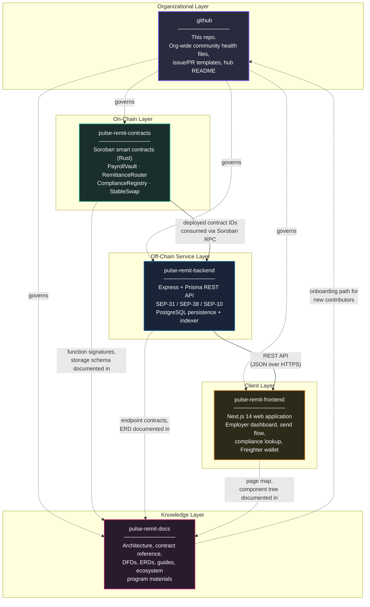
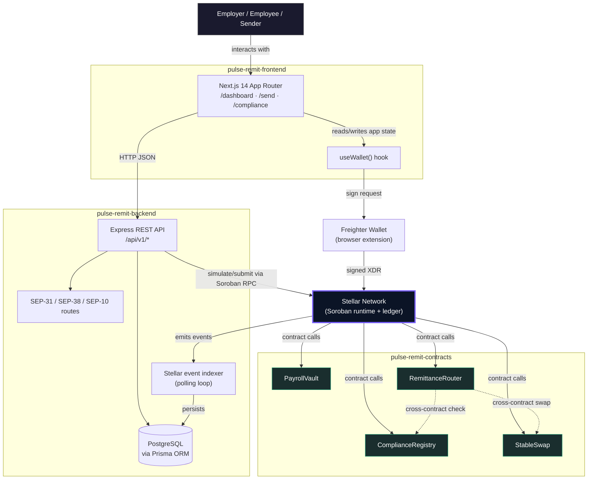
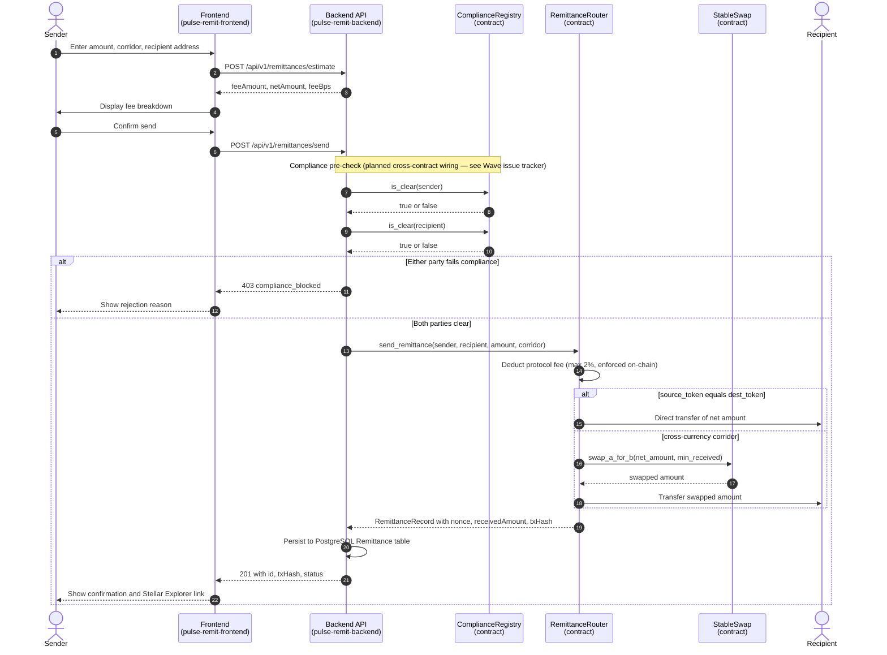
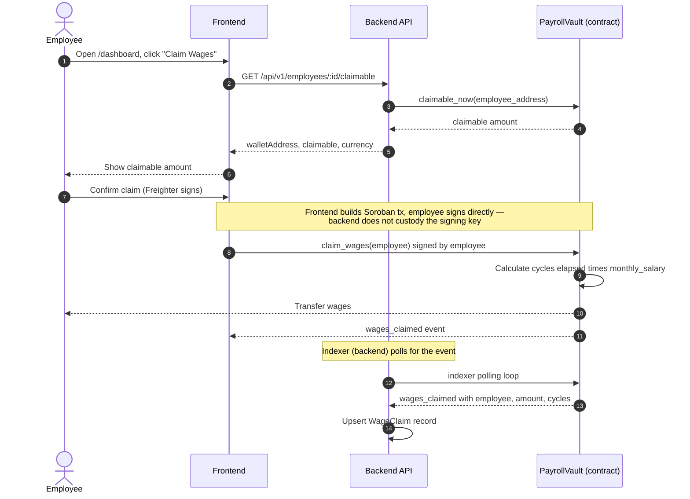
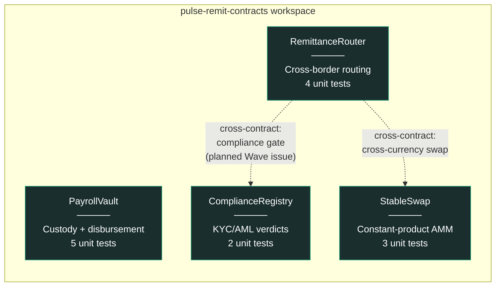
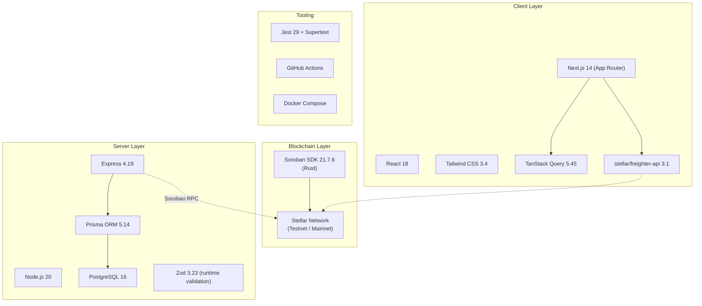
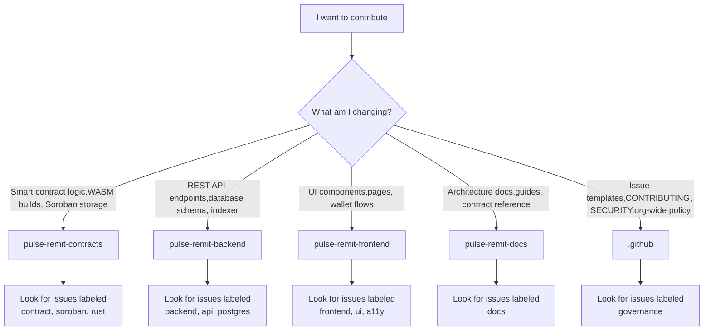
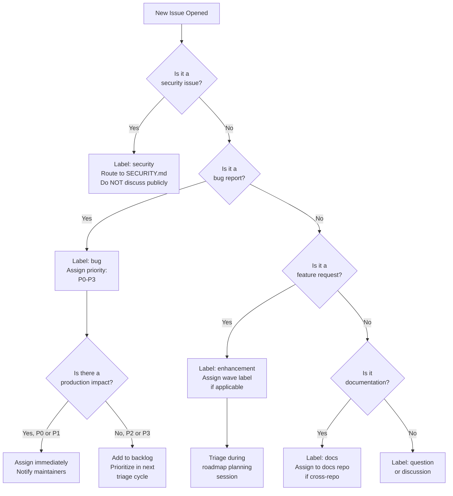
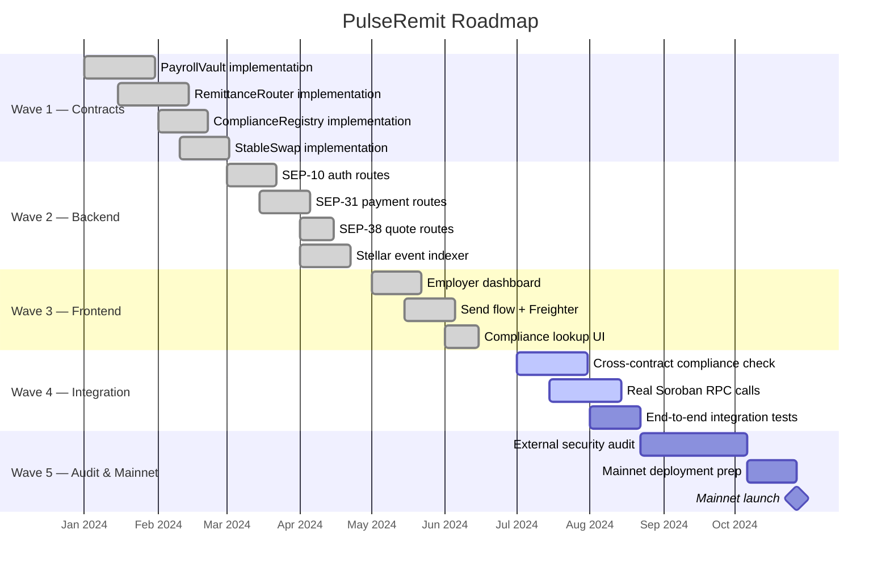

# PulseRemit

### Cross-Border Payroll & Remittance Infrastructure on Stellar

[](./LICENSE)
[](https://soroban.stellar.org)
[](https://github.com/stellar/stellar-protocol/blob/master/ecosystem/sep-0031.md)
[](https://github.com/stellar/stellar-protocol/blob/master/ecosystem/sep-0038.md)
[](https://github.com/stellar/stellar-protocol/blob/master/ecosystem/sep-0010.md)
[](#3-repository-constellation)

**This is the `.github` repository.** It is the organizational hub for the PulseRemit project — a five-repository system implementing non-custodial, cross-border payroll and remittance rails on the Stellar network. This document is the canonical entry point: it defines the full scope of the project, how the five repositories relate to one another, and how the project as a whole contributes to the Stellar network.

If you are looking for a specific repository's setup instructions, jump to [§3](#3-repository-constellation) for direct links. If you are trying to understand *why* this project exists and what problem it solves, keep reading from the top.

---

## Table of Contents

1. [What This Project Is](#1-what-this-project-is)
2. [The Problem: Why Cross-Border Payroll Is Broken](#2-the-problem-why-cross-border-payroll-is-broken)
3. [Repository Constellation](#3-repository-constellation)
4. [System Architecture](#4-system-architecture)
5. [End-to-End Data Flow](#5-end-to-end-data-flow)
6. [Contract Layer Summary](#6-contract-layer-summary)
7. [Data Model Summary](#7-data-model-summary)
8. [Stellar Ecosystem Standards Compliance](#8-stellar-ecosystem-standards-compliance)
9. [How This Project Contributes to the Stellar Network](#9-how-this-project-contributes-to-the-stellar-network)
10. [Technology Stack](#10-technology-stack)
11. [Getting Started (Full Stack)](#11-getting-started-full-stack)
12. [Repository Governance](#12-repository-governance)
13. [Community Health Files](#13-community-health-files)
14. [Versioning and Release Policy](#14-versioning-and-release-policy)
15. [Security](#15-security)
16. [Roadmap](#16-roadmap)
17. [Maintainers](#17-maintainers)
18. [License](#18-license)

---

## 1. What This Project Is

PulseRemit is infrastructure for moving money across borders using the Stellar network as the settlement layer, instead of the correspondent banking system. Concretely, it does two things:

- **Payroll**: an employer funds an on-chain vault once; employees in different countries claim their own wages directly from that vault on their own schedule, in USDC, without the employer initiating a transfer for every single payday.
- **Remittance**: a person in one country sends value to a person in another country, with the fee, the exchange rate, and the settlement all happening transparently on a public ledger instead of inside a bank's back office.

Both flows are built on **Soroban**, Stellar's smart contract platform, and both are wired into the **Stellar Ecosystem Proposals (SEPs)** — the standards that let independent wallets, exchanges, and payment processors interoperate on Stellar without bespoke integrations. That distinction matters: this is not a payments app that happens to use crypto as a backend. It is built to plug into the same interoperability layer that Stellar's anchor network already uses, so that any SEP-31-compliant sending institution can route a payment through it without custom code.

The project is deliberately split into five repositories rather than shipped as one. That decision, and what each repository is responsible for, is covered in [§3](#3-repository-constellation).

---

## 2. The Problem: Why Cross-Border Payroll Is Broken

A worker in Lagos employed by a company in London is paid through a chain that typically looks like this: the employer's bank debits GBP, a correspondent bank in the chain converts it, SWIFT messages coordinate the handoff, a receiving bank in Nigeria credits a Naira-denominated account — and at every hop, a fee is taken and the transaction is delayed. The World Bank's Remittance Prices Worldwide database has tracked average global remittance costs sitting stubbornly around 6–7% of the transfer amount for over a decade, more than double the UN Sustainable Development Goal target of 3%. For a worker sending $200 home, that is $12–14 gone before it arrives, on top of a settlement time measured in days, not seconds.

The structural reason this hasn't improved is that the correspondent banking network was designed for institutional transfers between banks that already trust each other, not for high-frequency, low-value, cross-border retail payments. Every additional intermediary bank in the chain adds a fee and a delay; there is no way to "skip" hops in a system built entirely out of bilateral relationships.

Stellar's core design — the Stellar Consensus Protocol enabling settlement in 3–5 seconds at a cost measured in fractions of a cent — exists specifically to remove those intermediary hops. PulseRemit is one concrete implementation of what that removal looks like in a real payroll and remittance context: employer funds a vault once, employees claim directly, cross-border transfers settle in seconds against transparent, capped fees, and everything is auditable on a public ledger instead of trapped inside separate banks' private systems.

---

## 3. Repository Constellation

The project is split into five repositories, each with a single, well-defined responsibility. This diagram shows how they relate:



### Why five repositories instead of one

| Reason | Explanation |
|---|---|
| **Independent release cycles** | The contracts repo changes rarely and every change requires a security-conscious review plus testnet redeployment. The frontend can ship UI fixes hourly. Coupling them in one repo forces one release cadence on both. |
| **Independent CI** | A contract-only change should not have to wait on a Next.js build, and vice versa. Each repo's CI (see each repo's `.github/workflows/ci.yml`) only runs what's relevant to it. |
| **Clear audit boundary** | Auditors reviewing the on-chain contracts should not need to wade through frontend React components to find the code that actually moves funds. |
| **Focused contribution** | A technical writer fixing documentation, a frontend developer improving accessibility, and a Rust engineer implementing a cross-contract call are three different audiences. Five repos let each contribute without touching code outside their domain. |
| **Standard practice at scale** | This mirrors how most production blockchain projects are organized — a project's core protocol contracts, its SDK/backend, its dApp frontend, and its documentation portal are conventionally separate repositories, often under one GitHub organization with a shared `.github` repo exactly like this one. |

### Direct links

| Repository | Purpose | Primary Language |
|---|---|---|
| [`pulse-remit-contracts`](https://github.com/YOUR_ORG/pulse-remit-contracts) | Soroban smart contracts | Rust |
| [`pulse-remit-backend`](https://github.com/YOUR_ORG/pulse-remit-backend) | REST API, SEP compliance, indexer | TypeScript (Node.js) |
| [`pulse-remit-frontend`](https://github.com/YOUR_ORG/pulse-remit-frontend) | Web application | TypeScript (Next.js) |
| [`pulse-remit-docs`](https://github.com/YOUR_ORG/pulse-remit-docs) | Architecture, references, guides | Markdown |
| `.github` | This repository — org governance | Markdown / YAML |

---

## 4. System Architecture

This is the complete system, spanning all five repositories, showing how a request moves from a person's browser down to the Stellar ledger and back.



### Layer responsibilities at a glance

| Layer | Repository | Owns | Does NOT own |
|---|---|---|---|
| Presentation | `pulse-remit-frontend` | UI state, wallet connection, form validation | Business rules, fee calculation logic, persistence |
| Application | `pulse-remit-backend` | REST API, SEP compliance surfaces, off-chain persistence, event indexing | Custody of funds, consensus, source of truth for balances |
| Settlement | `pulse-remit-contracts` | Fund custody, fee enforcement, compliance gating, atomic execution | UI rendering, HTTP semantics, database schema |
| Reference | `pulse-remit-docs` | Explaining the other three layers accurately | Executable code |
| Governance | `.github` | Contribution process, issue/PR templates, security policy | Any of the above |

A backend outage does not put funds at risk — the contracts remain the source of truth for balances and the compliance gate. A frontend outage does not stop existing payroll claims from being claimable — a user could, in principle, invoke the contract directly via the Stellar CLI. This separation of concerns is intentional and is the same design principle that makes the Stellar network itself resilient: no single off-chain component is a single point of failure for custody.

---

## 5. End-to-End Data Flow

The following sequence diagram traces one complete remittance from initiation to settlement, showing exactly which repository owns each step.



### Corresponding payroll claim flow



---

## 6. Contract Layer Summary

Four Soroban contracts, deployed independently, composed together at the application layer. Full function-by-function reference lives in `pulse-remit-contracts/README.md` and `pulse-remit-docs/contracts/contract-reference.md`.



| Contract | Responsibility | Test Count | Key Invariant |
|---|---|---|---|
| `PayrollVault` | Holds employer-funded balances; employees self-claim on schedule | 5 | Cannot disburse more than `monthly_salary × cycles_elapsed` per employee |
| `RemittanceRouter` | Routes payments between parties, deducts protocol fee, handles cross-currency via registered pools | 4 | Protocol fee is hard-capped at 200 basis points (2%), enforced in `initialize()` and `update_fee()` |
| `ComplianceRegistry` | Stores KYC/AML verdicts set by whitelisted verifiers | 2 | Only whitelisted verifier addresses can call `set_verdict()` |
| `StableSwap` | Constant-product (x·y=k) AMM pool for corridor liquidity | 3 | Liquidity removal cannot bypass the constant-product invariant |

**A note on architectural honesty**: Soroban contracts cannot call into the Stellar classic DEX, order book, or path payment operations — this is a platform-level constraint, not a design choice made by this project. `RemittanceRouter` therefore routes cross-currency corridors exclusively through registered Soroban AMM pool contracts (such as `StableSwap`), never through the SDEX. This constraint is documented directly in the contract source so it cannot be silently reintroduced by a future contributor.

---

## 7. Data Model Summary

The backend's persistence layer, expressed as an entity-relationship diagram with primary and foreign keys marked explicitly. This is the authoritative relational shape of everything the off-chain service layer tracks; the full Prisma schema lives in `pulse-remit-backend/prisma/schema.prisma`.


### Design notes on the data model

- **`Employee.walletAddress` is unique** — one Stellar address maps to exactly one employee record. This mirrors the on-chain `PayrollVault` contract, which keys employee records by `Address` in its own storage.
- **`Remittance.nonce` is unique** — it mirrors the monotonically increasing nonce assigned by `RemittanceRouter.send_remittance()` on-chain, giving every off-chain row a verifiable on-chain counterpart.
- **`ComplianceVerdict` has no direct foreign key into `Employee` or `Remittance`** — this is intentional. Compliance verdicts are keyed by wallet address, not by domain entity, because the same address might be a sender in one remittance and an employee in a payroll relationship; compliance status is a property of the address, not of a specific business relationship.
- **`IndexerCursor` is a singleton table** (`id` is always `1`) — this is the standard at-least-once-delivery pattern for blockchain event indexers: the cursor persists the last successfully processed ledger so a restarted indexer resumes rather than re-scanning from genesis or silently skipping events.

---

## 8. Stellar Ecosystem Standards Compliance

PulseRemit implements three Stellar Ecosystem Proposals (SEPs), which are the standards that let independently-operated Stellar services interoperate without bilateral integration agreements — the same role that ISO 20022 or SWIFT MT messages play in traditional finance, but open and permissionless.

| SEP | Name | What It Standardizes | Where It's Implemented |
|---|---|---|---|
| SEP-1 | `stellar.toml` | Service discovery — lets any client find this anchor's endpoints, supported currencies, and signing key from a well-known URL | `pulse-remit-backend/public/.well-known/stellar.toml` |
| SEP-10 | Stellar Web Authentication | Proves a client controls a Stellar keypair without ever transmitting the private key, via a signed challenge transaction | `pulse-remit-backend/src/routes/auth.routes.ts` |
| SEP-31 | Cross-Border Payments API | Standardizes how one financial institution hands off a payment to another institution's receive-side rails | `pulse-remit-backend/src/routes/sep31.routes.ts` |
| SEP-38 | Anchor RFQ (Quote) API | Standardizes how a sending party requests a firm, time-limited exchange rate before committing to a transfer | `pulse-remit-backend/src/routes/sep38.routes.ts` |

Implementing these standards — rather than a bespoke REST API that only this project's own frontend understands — is what separates "an app that uses Stellar" from "infrastructure the Stellar ecosystem can build on." Any SEP-31-compliant sending institution (a wallet, an exchange, another anchor) can integrate with PulseRemit's receive side using code they may have already written to talk to other Stellar anchors.

---

## 9. How This Project Contributes to the Stellar Network

This section speaks in general terms about ecosystem contribution — not about any specific grant or contributor program — because the value described here is intended to hold regardless of which program, if any, is evaluating it.

### 9.1 It exercises a use case Stellar was built for

Stellar's founding design goal, as described in its original consensus paper, was closing the gap between the world's disconnected financial systems — explicitly citing the excessive cost and friction of moving money across borders for underserved populations. PulseRemit is a direct, working instance of that goal: real payroll disbursement and real remittance routing, denominated in a stable asset, settling in seconds, with fees capped and enforced at the protocol level rather than left to institutional discretion.

### 9.2 It adds composable financial primitives to the ecosystem

`StableSwap` is a general-purpose constant-product AMM pool, not something hardcoded to only work inside `RemittanceRouter`. Any other Soroban contract that needs a liquidity pool for a stable-asset pair can register with and route through it. This is the same compounding effect that made early Ethereum DeFi primitives — constant-product AMMs, in particular — valuable well beyond their original application: a working, tested implementation lowers the cost for the next builder who needs the same primitive.

### 9.3 It demonstrates real interoperability, not just Soroban usage

Many smart-contract projects on any chain stop at "the contract works." PulseRemit's backend implements SEP-31, SEP-38, and SEP-10 — meaning the project is reachable by the existing Stellar anchor ecosystem via standards those anchors already speak, rather than requiring every counterparty to learn a project-specific API. This is a meaningfully higher bar than a contract deployed in isolation, and it is the kind of interoperability the SEP process exists to encourage across the entire network, not just within one application.

### 9.4 It produces reusable reference material

The `pulse-remit-docs` repository documents, in detail, the actual cross-contract call patterns, the actual data flow, and the actual constraints encountered while building on Soroban — including the SDEX-access limitation described in [§6](#6-contract-layer-summary). Documentation of real, encountered constraints, not just happy-path tutorials, has direct value to the next team building payment infrastructure on Stellar, reducing the time they spend rediscovering the same platform boundaries.

### 9.5 It is structured for community contribution, not just personal use

The five-repository split, the CI on every repository, the labeled and leveled issue backlog spanning beginner-friendly through advanced Soroban work, and this hub document all exist so that someone other than the original author can productively contribute without a lengthy onboarding conversation. A codebase that only its author can extend does not compound; one that a community can extend does.

---

## 10. Technology Stack



| Category | Choice | Rationale |
|---|---|---|
| Smart contract language | Rust via Soroban SDK | Only supported first-class language for Soroban contracts |
| Backend runtime | Node.js 20 (LTS) | Long-term support window covers the project's expected maintenance horizon |
| Backend framework | Express 4 | Minimal, well-understood, easy for new contributors to read without framework-specific magic |
| ORM | Prisma 5 | Type-safe query building; schema-as-code matches the "infrastructure as code" ethos of the rest of the stack |
| Database | PostgreSQL 16 | Relational integrity for financial records; JSON support where semi-structured SEP fields are needed |
| Validation | Zod | Runtime schema validation with static type inference — one schema definition produces both the validator and the TypeScript type |
| Frontend framework | Next.js 14 App Router | Server components reduce client bundle size; file-based routing matches the project's page structure directly |
| Styling | Tailwind CSS | Utility-first approach keeps styling co-located with markup, easing onboarding for contributors unfamiliar with the codebase |
| Data fetching | TanStack Query | Caching, refetching, and loading-state management without hand-rolled `useEffect` chains |
| Wallet integration | Freighter API | The most widely adopted Stellar browser wallet at time of writing |

---

## 11. Getting Started (Full Stack)

This section wires the five repositories together for local development. Each repository's own README has repo-specific detail; this is the shortest path to a fully running stack.

```bash
# 1. Clone all five repositories into a common parent directory
mkdir pulse-remit && cd pulse-remit
git clone https://github.com/YOUR_ORG/pulse-remit-contracts.git
git clone https://github.com/YOUR_ORG/pulse-remit-backend.git
git clone https://github.com/YOUR_ORG/pulse-remit-frontend.git
git clone https://github.com/YOUR_ORG/pulse-remit-docs.git

# 2. Build and test the contracts (requires Rust + Stellar CLI — see contracts README)
cd pulse-remit-contracts
cargo build --release --target wasm32-unknown-unknown
cargo test
./scripts/deploy.sh testnet
./scripts/init-contracts.sh testnet
cd ..

# 3. Start the backend, pointing it at the contract IDs from step 2
cd pulse-remit-backend
cp .env.example .env   # fill in contract IDs + DATABASE_URL
npm install
npm run db:migrate && npm run db:generate && npm run db:seed
npm run dev             # http://localhost:3001
cd ..

# 4. Start the frontend, pointing it at the backend
cd pulse-remit-frontend
cp .env.example .env.local
npm install
npm run dev              # http://localhost:3000
```

At this point: the contracts are live on Stellar testnet, the backend is serving the REST + SEP APIs against them, and the frontend is running against the backend. Open `http://localhost:3000` to use the application end to end.

---

## 12. Repository Governance

| Decision Area | Owner | Notes |
|---|---|---|
| Contract changes | `pulse-remit-contracts` maintainers | Requires passing `cargo test`, `cargo clippy -- -D warnings`, and `cargo fmt --check` in CI before merge |
| API contract changes | `pulse-remit-backend` maintainers | Breaking changes to any `/api/v1/*` response shape require a version note in that repo's `CHANGELOG.md` |
| Community health defaults | This repo (`.github`) | `CONTRIBUTING.md`, `SECURITY.md`, issue templates, and the PR template defined here apply by default to every repository in the organization that does not define its own |
| Cross-repo architectural decisions | This repo (`.github`), via GitHub Discussions | Anything touching more than one repository's contract — e.g. a new API endpoint the frontend depends on — should be discussed here before implementation begins in the affected repos |

---

## 13. Community Health Files

This repository, because it is named exactly `.github` at the organization level, supplies **default community health files** for every repository in the organization that does not define its own. GitHub applies this automatically.

| File | Applies To | Purpose |
|---|---|---|
| `CONTRIBUTING.md` | All repos without their own | How to propose changes, coding standards, commit conventions |
| `SECURITY.md` | All repos without their own | Responsible disclosure process for vulnerabilities |
| `CODE_OF_CONDUCT.md` | All repos without their own | Expected behavior in issues, PRs, and discussions |
| `ISSUE_TEMPLATE/` | All repos without their own | Structured bug report and contribution templates |
| `PULL_REQUEST_TEMPLATE.md` | All repos without their own | Checklist ensuring tests, docs, and issue links are present before review |
| `CODEOWNERS` | This repo specifically | Review routing for changes to governance files themselves |
| `FUNDING.yml` | Displays the "Sponsor" button across the organization | Points to the project's funding/ecosystem-program page |

---

## 14. Versioning and Release Policy

Each repository is versioned and released independently using Semantic Versioning:

- **`pulse-remit-contracts`** — a version bump corresponds to a new WASM build. Major version bumps indicate a storage-layout-breaking change requiring migration; these are called out explicitly in that repo's `CHANGELOG.md` and require redeployment. Soroban contracts are immutable once deployed — a breaking change means a new contract ID, not an in-place upgrade, unless the contract explicitly implements an upgrade pattern.
- **`pulse-remit-backend`** — a major version bump indicates a breaking change to a public `/api/v1/*` response shape.
- **`pulse-remit-frontend`** — versioned independently; typically follows whichever backend API version it targets.
- **`pulse-remit-docs`** — versioned to track which contract, backend, and frontend versions its content describes as current.

Cross-repository compatibility is tracked in this hub repository's `CHANGELOG.md`, which records which versions of each of the four downstream repos are known to work together.

---

## 15. Security

Responsible disclosure for security issues in **any** of the five repositories should follow the process in `SECURITY.md` in this repository, which applies as the organization-wide default. Do not open public issues for suspected vulnerabilities.

**Current audit status**: none of the four Soroban contracts have undergone an external, professional security audit at this time. They are deployed to Stellar testnet only. Do not deploy to Stellar mainnet with real value at stake without a completed audit.

---

## 16. Roadmap

| Status | Milestone |
|---|---|
| Done | Four core Soroban contracts implemented and unit-tested |
| Done | SEP-1, SEP-10, SEP-31, SEP-38 backend surfaces implemented |
| Done | Employer dashboard, send flow, and compliance lookup UI |
| Done | Freighter wallet connection wired into the frontend |
| In progress | Cross-contract compliance check wired directly into `RemittanceRouter` (currently enforced at the API layer only) |
| In progress | Real Soroban RPC calls replacing simulation placeholders in the backend's `StellarService` |
| Planned | Independent security audit of all four contracts prior to any mainnet deployment |
| Planned | SEP-24 (interactive deposit/withdrawal) integration for direct fiat on/off-ramp |
| Planned | Multi-signature admin controls for `PayrollVault` and `ComplianceRegistry` admin functions |

---

## 17. Maintainers

**Maintainer** — Lead Maintainer across all five repositories.

Issue and PR triage is prioritized on a rolling basis. For architectural questions spanning more than one repository, open a Discussion here rather than an issue in an individual repo.

> Replace the placeholder above with real maintainer information before publishing.

---

## 18. License

All five repositories are licensed under Apache 2.0. See `LICENSE` in this repository and in each individual repository.

---

## Appendix: Document Map

Every long-form document in this project, in one place:

| Document | Repository | Covers |
|---|---|---|
| This file | `.github` | Whole-project scope, repo relationships, Stellar contribution |
| `pulse-remit-contracts/README.md` | `pulse-remit-contracts` | Contract architecture, function reference, storage schemas, testing |
| `pulse-remit-backend/README.md` | `pulse-remit-backend` | API reference, ERD, SEP implementation detail, environment setup |
| `pulse-remit-frontend/README.md` | `pulse-remit-frontend` | Page map, component architecture, wallet integration, styling |
| `pulse-remit-docs/README.md` | `pulse-remit-docs` | Index of all deep-dive architecture docs, DFDs, and guides |
| `pulse-remit-docs/architecture/system-overview.md` | `pulse-remit-docs` | Narrative architecture walkthrough with worked examples |
| `pulse-remit-docs/contracts/contract-reference.md` | `pulse-remit-docs` | Full per-function contract API reference |
| `pulse-remit-docs/guides/quickstart.md` | `pulse-remit-docs` | Fastest path from clone to a running local stack |

---

## 19. Contribution Guide

### Finding the right repository

Before opening a PR, identify which repository your change belongs to. Use this decision tree:



### Issue labels explained

| Label | Meaning | Repos |
|---|---|---|
| `good-first-issue` | Low barrier to entry, well-scoped, clear acceptance criteria | All |
| `wave-1` through `wave-5` | Maps to the contribution wave system — see [§28](#28-roadmap-details) | All |
| `security` | Involves auth, compliance gating, key management, or fund custody | contracts, backend |
| `docs` | Documentation-only change, no executable code modified | docs, any repo |
| `breaking` | Will change a public API contract, storage layout, or response shape | contracts, backend |
| `ci` | GitHub Actions workflow, build pipeline, or test infrastructure change | Any repo |
| `deps` | Dependency update — may require cross-repo compatibility check | Any repo |
| `blocked` | Cannot be merged until another issue or external event is resolved | Any repo |

### The contribution workflow end-to-end

1. **Find an issue** — Browse the issue tracker of the relevant repository. Issues labeled `good-first-issue` are the recommended starting point for first-time contributors.
2. **Fork the repository** — Fork to your personal GitHub account. Never push directly to the organization repos.
3. **Create a branch** — Branch naming convention: `<type>/<short-description>` (e.g., `fix/vault-overflow-check`, `feat/sep24-deposit`).
4. **Write code** — Follow the coding standards for that repository (see each repo's `CONTRIBUTING.md`). Contracts require `cargo fmt` and `cargo clippy -- -D warnings`; backend requires ESLint; frontend requires ESLint + Prettier.
5. **Write or update tests** — Every change must have test coverage. Contracts require unit tests in Rust; backend requires Jest + Supertest; frontend requires Playwright or Vitest depending on the component.
6. **Open a PR** — Use the PR template from `.github/PULL_REQUEST_TEMPLATE.md`. Link the originating issue. Fill in the "What changed" and "Why it changed" sections.
7. **Code review** — At least one maintainer approval required. Contract changes require two approvals.
8. **Merge** — Squash merge to main. The CI must pass before merge is allowed.


### Code review expectations by repository type

| Repository | Review Focus | Minimum Approvals | Extra Requirements |
|---|---|---|---|
| `pulse-remit-contracts` | Security, gas efficiency, auth patterns, storage invariants, cross-contract call safety | 2 | `cargo clippy -- -D warnings` must pass; no new `unsafe` blocks without justification |
| `pulse-remit-backend` | API contract compatibility, schema migration safety, input validation, error handling | 1 | Migration must be reversible; new endpoints must have OpenAPI schema updates |
| `pulse-remit-frontend` | Accessibility (WCAG 2.1 AA), performance bundle impact, responsive design, wallet error handling | 1 | Lighthouse score must not regress; no new `console.log` in production code |
| `pulse-remit-docs` | Technical accuracy verified against source code, consistent formatting, no broken links | 1 | Markdown lint must pass; any code samples must compile or run |
| `.github` | Consistency across all repos the template applies to, clarity of language | 1 | Changes to `CONTRIBUTING.md` or `SECURITY.md` require maintainer discussion first |

### What makes a good PR description

A good PR description answers three questions:
1. **What changed** — A bullet list of every concrete change (new function, modified endpoint, updated doc section).
2. **Why it changed** — Link to the issue. If there is no issue, explain the motivation.
3. **How to verify** — Exact steps a reviewer can follow to confirm the change works (test commands, manual verification steps, contract deployment commands).

Bad: "Fixed stuff." Good: "Fixes #42 — Added bounds check in `PayrollVault.disburse()` to prevent overflow when `cycles_elapsed > 12`. Verified with `cargo test --test vault_overflow` which now passes. No storage layout change."

---

## 20. Code Review Process

### Review responsibilities per repository

Every PR must be reviewed by someone familiar with the repository's domain. The table below defines what "familiar" means in practice.

| Repository | Primary Reviewer Domain | Secondary Reviewer | Review Focus |
|---|---|---|---|
| `pulse-remit-contracts` | Rust / Soroban security | Cross-contract interaction specialist | Correctness, gas, auth, storage, cross-contract safety |
| `pulse-remit-backend` | Node.js / Express / Prisma | SEP protocol compliance | API shape, schema migration, error codes, indexing correctness |
| `pulse-remit-frontend` | React / Next.js / a11y | UX / design consistency | Component structure, accessibility, performance, wallet UX |
| `pulse-remit-docs` | Technical writing | Source-code verifier | Accuracy, completeness, formatting, link validity |

### Contract code review: extra scrutiny requirements

Contract code moves real funds. Every contract PR must be reviewed against these additional criteria:

- **Authorization pattern**: Does every state-mutating function correctly use `require_auth()` or `check_auth()`? Are there any paths where an unauthorized caller can trigger fund movement?
- **Storage invariants**: Does the new code maintain the invariants listed in [§6](#6-contract-layer-summary)? Specifically: can `PayrollVault` ever disburse more than `monthly_salary × cycles_elapsed`? Can `StableSwap` liquidity removal bypass the constant-product invariant?
- **Gas budget**: Does the new function stay within Soroban's compute budget for typical call patterns? Run `cargo test --features bench` if available.
- **Upgrade path**: If the contract implements `upgrade()` (all four currently do not), is the storage layout forward-compatible?
- **Cross-contract calls**: If the PR adds a new cross-contract call (e.g., `RemittanceRouter` calling `ComplianceRegistry`), is the called contract's interface stable and tested?

### Backend code review: API contract compatibility

- **Breaking change detection**: Does the PR change the shape of any `/api/v1/*` response? If so, does it bump the version or add a new endpoint instead?
- **Schema migration**: If the PR includes a Prisma migration, is it forward-compatible (no destructive column drops without a two-step deploy)?
- **Error handling**: Are all error paths returning the correct HTTP status code and a structured error body consistent with the existing error format?
- **Input validation**: Are all inputs validated with Zod schemas before reaching the database layer?

### Frontend code review: accessibility, performance, UX

- **Accessibility**: Does the new component pass `axe-core` checks? Are interactive elements keyboard-navigable? Do images have alt text?
- **Performance**: Does the new code introduce any new JavaScript that will be included in the initial bundle? If so, is it lazy-loaded?
- **UX consistency**: Does the new page/component match the existing design system? Are loading states, error states, and empty states all handled?
- **Wallet integration**: If the PR touches wallet connection logic, does it handle Freighter errors gracefully (user rejected, extension not installed, wrong network)?

### Documentation review: accuracy verification

- **Source code check**: Every code sample, function signature, and behavior claim in the documentation must be verified against the current source code. Do not accept documentation PRs that describe behavior without citing the source.
- **Link validity**: All internal links must resolve. External links to Stellar documentation should point to the latest published version.
- **Formatting**: Run the markdown linter. Ensure consistent heading hierarchy, table formatting, and code block language annotations.

### Review criteria summary table

| Criterion | Contracts | Backend | Frontend | Docs |
|---|---|---|---|---|
| Security / auth | Primary | High | Medium | N/A |
| Gas / performance | Primary | Low | Medium (bundle size) | N/A |
| Storage invariants | Primary | Medium (DB) | N/A | N/A |
| API compatibility | N/A | Primary | High | Medium |
| Accessibility | N/A | N/A | Primary | N/A |
| Test coverage | Required | Required | Required | N/A |
| Accuracy vs source | N/A | N/A | N/A | Primary |
| Link validity | N/A | N/A | N/A | Required |

---

## 21. Issue Triage Process

### How new issues are categorized

When a new issue is opened in any of the five repositories, the triage process follows this path:



### Priority levels

| Priority | Label | Definition | Response Target |
|---|---|---|---|
| P0 | `priority:critical` | Funds at risk, data loss, security vulnerability, or production system down | 24 hours |
| P1 | `priority:high` | Core flow broken (cannot send remittance, cannot claim wages), no fund risk | 48 hours |
| P2 | `priority:medium` | Degraded functionality, UX regression, non-critical feature broken | 1 week |
| P3 | `priority:low` | Cosmetic issue, nice-to-have, documentation improvement | Next roadmap cycle |

### Assignment process

1. **P0/P1**: Assigned to the most appropriate maintainer immediately. If the maintainer is unavailable, the issue escalates to the project lead.
2. **P2/P3**: Assigned during the weekly triage cycle (every Monday). Contributors can self-assign issues labeled `good-first-issue`.
3. **Wave-labeled issues**: Assigned during roadmap planning sessions, aligned with the wave schedule in [§28](#28-roadmap-details).

### Stale issue policy

- Issues with no activity for 30 days receive a stale bot comment asking for status.
- Issues with no activity for 60 days are labeled `stale`.
- Issues with no activity for 90 days are closed automatically.
- Any contributor can reopen a closed stale issue by commenting with new information.

---

## 22. Release Process

### Per-repository release cadence

| Repository | Typical Cadence | Release Trigger |
|---|---|---|
| `pulse-remit-contracts` | Ad hoc, every 2–6 weeks | New contract version or bugfix requiring testnet redeployment |
| `pulse-remit-backend` | Weekly | API changes, schema migrations, indexer improvements |
| `pulse-remit-frontend` | Weekly (often same day as backend) | UI changes, bugfixes, dependency updates |
| `pulse-remit-docs` | As needed, typically after contract or backend release | Documentation must reflect current contract/backend versions |
| `.github` | As needed | Changes to org-wide templates, policies, or governance |

### Semantic versioning rules

| Repo | Major Version Bump | Minor Version Bump | Patch Version Bump |
|---|---|---|---|
| `pulse-remit-contracts` | Storage-layout-breaking change; requires new contract deployment | New function added or existing function signature changed (non-breaking) | Bugfix with no API or storage change |
| `pulse-remit-backend` | Breaking change to any `/api/v1/*` response shape | New endpoint added or existing endpoint behavior changed (backward-compatible) | Bugfix, dependency update, indexer improvement |
| `pulse-remit-frontend` | Breaking change in page structure or routing | New feature or significant UI improvement | Bugfix, style adjustment, dependency update |
| `pulse-remit-docs` | Major rewrite reflecting architectural change | New sections or guides added | Typo fixes, link updates, clarifications |

### Contract release: WASM artifact publication

```
1. All tests pass: cargo test --release
2. Clippy clean: cargo clippy -- -D warnings
3. Format check: cargo fmt --check
4. Build WASM: cargo build --release --target wasm32-unknown-unknown
5. Tag release: git tag v<MAJOR>.<MINOR>.<PATCH>
6. Deploy to testnet: ./scripts/deploy.sh testnet
7. Initialize contracts: ./scripts/init-contracts.sh testnet
8. Record new contract IDs in pulse-remit-backend .env
9. Publish release on GitHub with WASM artifact attached
```

### Backend release: API compatibility verification

```
1. All tests pass: npm test
2. Lint clean: npm run lint
3. Type check: npm run typecheck
4. Run integration tests against testnet contracts
5. Verify no breaking changes to /api/v1/* responses
6. Update CHANGELOG.md
7. Tag and publish GitHub release
8. Deploy to staging, verify with frontend
9. Deploy to production
```

### Cross-repo compatibility matrix

| Backend Version | Contracts Version | Frontend Version | Status |
|---|---|---|---|
| `0.x` | `0.x` | `0.x` | Initial testnet integration |
| Future | Future | Future | Tracked in this hub's `CHANGELOG.md` |

### Release checklist table

| Step | Contracts | Backend | Frontend | Docs |
|---|---|---|---|---|
| All tests pass | `cargo test` | `npm test` | `npm test` | N/A |
| Linter clean | `cargo clippy` | `npm run lint` | `npm run lint` | `markdownlint` |
| Format check | `cargo fmt --check` | Prettier | Prettier | N/A |
| Type check | Rust compiler | `npm run typecheck` | `npm run typecheck` | N/A |
| Build artifact | WASM binary | Docker image | Static export | N/A |
| Update CHANGELOG | Yes | Yes | Yes | Yes |
| Tag release | `git tag` | `git tag` | `git tag` | `git tag` |
| GitHub Release | Yes + WASM attached | Yes | Yes | Yes |
| Deployment | testnet via `deploy.sh` | staging → production | Vercel / static host | GitHub Pages |

---

## 23. Monitoring and Observability

### Health check endpoints

| Endpoint | Repository | Returns | Use |
|---|---|---|---|
| `GET /health` | `pulse-remit-backend` | `{"status":"ok","db":"connected","stellar":"reachable"}` | Load balancer uptime probe |
| `GET /health/ready` | `pulse-remit-backend` | `{"ready":true}` | Kubernetes readiness probe — returns 503 if DB or Stellar RPC is unreachable |
| `GET /health/live` | `pulse-remit-backend` | `{"alive":true}` | Kubernetes liveness probe — always returns 200 if process is running |

### Log aggregation strategy

All backend logs are structured JSON written to stdout, compatible with any log aggregator (CloudWatch, Datadog, ELK, Loki). Log fields:

| Field | Type | Description |
|---|---|---|
| `timestamp` | ISO 8601 | When the log entry was generated |
| `level` | `info` / `warn` / `error` | Severity level |
| `service` | `pulse-remit-backend` | Service identifier |
| `requestId` | UUID | Correlation ID for request tracing |
| `action` | string | What operation was performed (e.g., `remittance.send`, `compliance.check`) |
| `durationMs` | number | How long the operation took |
| `error` | string (optional) | Error message if the operation failed |

### Metrics to monitor

| Metric | Type | Description | Alert Threshold |
|---|---|---|---|
| `api_request_duration_ms` | Histogram | End-to-end API response time | p99 > 2000ms for 5 minutes |
| `api_error_rate` | Gauge | Percentage of 4xx/5xx responses | > 5% for 5 minutes |
| `indexer_lag_ledgers` | Gauge | Difference between latest ledger and last indexed ledger | > 100 ledgers (~50 seconds) |
| `indexer_events_processed_total` | Counter | Total events processed since last restart | Monitor for stalls (no increase for > 5 minutes) |
| `contract_call_success_rate` | Gauge | Percentage of Soroban RPC calls that succeed | < 95% for 5 minutes |
| `contract_call_duration_ms` | Histogram | Soroban RPC call round-trip time | p99 > 5000ms for 5 minutes |
| `db_connection_pool_active` | Gauge | Active database connections | > 80% of `DATABASE_CONNECTION_LIMIT` |
| `db_query_duration_ms` | Histogram | Prisma query execution time | p99 > 500ms for 5 minutes |
| `compliance_check_duration_ms` | Histogram | Time to verify sender + recipient compliance | p99 > 1000ms for 5 minutes |
| `stellar_network_fee` | Gauge | Current Stellar base fee in stroops | > 10,000 stroops (indicates network congestion) |

### Recommended metrics and thresholds summary

| Metric | Warning | Critical | Measurement Window |
|---|---|---|---|
| API p99 latency | > 1500ms | > 2000ms | 5 minutes |
| API error rate | > 2% | > 5% | 5 minutes |
| Indexer lag | > 50 ledgers | > 100 ledgers | 5 minutes |
| Contract call failure rate | > 5% | > 10% | 5 minutes |
| DB connection pool utilization | > 60% | > 80% | 5 minutes |
| DB query p99 latency | > 300ms | > 500ms | 5 minutes |
| Stellar base fee | > 5,000 stroops | > 10,000 stroops | 1 minute |

---

## 24. Disaster Recovery

### Database backup strategy for PostgreSQL

| Backup Type | Frequency | Retention | Storage |
|---|---|---|---|
| Full pg_dump | Daily at 02:00 UTC | 30 days | Encrypted S3 bucket, different region from primary |
| WAL archival (continuous) | Continuous | 7 days | S3 with lifecycle policy |
| Point-in-time recovery | On demand | Up to 7 days from current | Restore from WAL + last full backup |

### Contract redeployment procedures

Soroban contracts are immutable once deployed. A "redeployment" means deploying a new WASM build under a new contract ID and updating the backend to point at the new ID.

```
1. Build new WASM: cargo build --release --target wasm32-unknown-unknown
2. Deploy to testnet: stellar contract deploy --wasm target/wasm32-unknown-unknown/release/<contract>.wasm
3. Initialize: stellar contract invoke --id <NEW_CONTRACT_ID> -- initialize <args>
4. If cross-contract wiring changed: update the called contract's address in the caller's storage
5. Update pulse-remit-backend .env with new contract ID
6. Verify: run integration test suite against new contract ID
7. Tag release in contracts repo with new contract ID in release notes
```

> **Important**: The old contract ID remains on the ledger and its state is preserved. If the old contract holds funds, those funds must be migrated before the backend switches to the new contract.

### Key rotation procedures

| Key Type | Rotation Frequency | Procedure |
|---|---|---|
| Backend admin signing key | Every 90 days | Generate new keypair, update `ADMIN_SECRET` in backend env, re-whitelist in contract admin storage |
| Compliance registry verifier key | Every 90 days | Generate new keypair, update backend env, call `add_verifier()` on ComplianceRegistry, remove old verifier with `remove_verifier()` |
| Database credentials | Every 90 days | Rotate PostgreSQL password, update `DATABASE_URL` in backend env, restart backend |
| SEP-10 signing key | Every 90 days | Generate new keypair, update `stellar.toml` and backend env, publish new `stellar.toml` |

### Recovery time objectives per component

| Component | RTO (Recovery Time Objective) | RPO (Recovery Point Objective) | Notes |
|---|---|---|---|
| PostgreSQL | 15 minutes | 1 minute (WAL) | Restore from latest WAL backup + point-in-time recovery |
| Backend API | 5 minutes | 0 (stateless) | Redeploy container; no persistent state in the service itself |
| Frontend | 2 minutes | 0 (static) | Re-deploy static assets to CDN/host |
| Stellar contracts | N/A (on-ledger) | 0 | Contracts are on the ledger; redeployment is only needed for upgrades, not recovery |
| Indexer | 10 minutes | Last processed ledger | Restart from `IndexerCursor` singleton row |

### Recovery procedure table

| Scenario | Detection | Recovery Steps | Verification |
|---|---|---|---|
| Database corruption | Health check returns `db:disconnected` | Restore from latest WAL backup; replay to point-in-time | `SELECT COUNT(*)` on key tables; run integration test suite |
| Backend crash loop | Container restart count > 3 in 5 minutes | Check logs, fix issue, redeploy; or rollback to last known-good image | Health check returns `ok`; run smoke test suite |
| Contract vulnerability discovered | Security audit or external report | Pause backend (return 503 for all mutation endpoints); deploy fixed contract; migrate funds; update backend | Full integration test suite; external audit of fix |
| Stellar network outage | Indexer lag > 1000 ledgers | Wait for network recovery; indexer auto-resumes from `IndexerCursor` | Indexer lag returns to < 100 ledgers |
| Key compromise | Unauthorized transaction detected | Rotate all affected keys immediately; contact Stellar security if mainnet funds are at risk | Verify no unauthorized transactions after rotation |

---

## 25. Compliance and Regulatory Considerations

### KYC/AML compliance via ComplianceRegistry

The `ComplianceRegistry` contract is the on-chain source of truth for KYC/AML status. It stores verdicts set by whitelisted verifier addresses and is checked before any remittance is processed.

| Verdict | Meaning | Effect on Transactions |
|---|---|---|
| `Unverified` (default) | No KYC/AML check has been performed for this address | Remittance blocked at API layer (enforced in `pulse-remit-backend`) |
| `Approved` | Address has passed KYC/AML verification | Remittance allowed |
| `Flagged` | Address is under review; suspicious but not confirmed | Remittance allowed but logged for manual review |
| `Blocked` | Address has failed KYC/AML verification | Remittance blocked at API layer and on-chain (planned cross-contract check) |

### The role of SEP-31 in regulatory compliance

SEP-31 standardizes the information that must be exchanged between a sending institution and a receiving institution for a cross-border payment. This includes:

- **Sender identity** (via SEP-12 integration)
- **Recipient identity** (via SEP-12 integration)
- **Payment purpose** and regulatory classification
- **Fee disclosure** before execution
- **Transaction tracking** via unique IDs

By implementing SEP-31, PulseRemit ensures that every cross-border payment carries the metadata that regulators expect, without requiring each integration partner to define their own compliance surface.

### Data retention policies

| Data Type | Retention Period | Storage | Rationale |
|---|---|---|---|
| Transaction records (Remittance, WageClaim) | 7 years | PostgreSQL + encrypted backup | Financial regulations require transaction record retention |
| Compliance verdicts | Until explicitly revoked + 7 years | On-chain (ComplianceRegistry) + PostgreSQL | Audit trail must persist beyond the on-chain verdict's lifetime |
| SEP-31 transaction metadata | 7 years | PostgreSQL | Regulatory requirement for cross-border payment records |
| API access logs | 90 days | Log aggregation system | Operational debugging; no PII in access logs |
| User session data | 24 hours | Backend memory (not persisted) | Stateless sessions; SEP-10 challenge-response does not require server-side session storage |

### Audit trail properties of Stellar ledger

The Stellar ledger provides inherent audit trail properties that traditional remittance systems cannot match:

- **Immutability**: Once a transaction is confirmed, it cannot be altered or deleted. The remittance's `txHash` in the database is a verifiable, permanent record.
- **Public verifiability**: Any party can independently verify a transaction by looking it up on the Stellar network via any Horizon server.
- **Deterministic execution**: Smart contract logic is deterministic — given the same inputs, the contract produces the same outputs. This makes auditable, reproducible verification possible.
- **Event emission**: Soroban contracts emit events that are permanently stored in the ledger. The indexer in `pulse-remit-backend` captures these events, but they are independently verifiable on-chain.

### Compliance features implementation table

| Compliance Feature | Implementation | Repository | Status |
|---|---|---|---|
| KYC/AML verdict storage | `ComplianceRegistry` contract | contracts | Implemented |
| KYC/AML pre-check (API layer) | `POST /api/v1/remittances/send` checks verdict | backend | Implemented |
| KYC/AML pre-check (on-chain) | Cross-contract call from `RemittanceRouter` to `ComplianceRegistry` | contracts | In progress |
| Sender/recipient identity | SEP-12 integration (planned) | backend | Planned |
| Fee disclosure | SEP-38 quote API | backend | Implemented |
| Transaction tracking | SEP-31 transaction lifecycle | backend | Implemented |
| Regulatory metadata exchange | SEP-31 structured fields | backend | Implemented |
| Audit trail | Stellar ledger + PostgreSQL records | contracts, backend | Implemented |

---

## 26. Performance Benchmarks

### API response time targets

| Endpoint Category | Target (p50) | Target (p95) | Target (p99) | Measurement |
|---|---|---|---|---|
| `GET /health` | < 10ms | < 50ms | < 100ms | Server-side |
| `GET /api/v1/employees/:id/claimable` | < 50ms | < 200ms | < 500ms | Server-side, excludes Stellar RPC call |
| `POST /api/v1/remittances/estimate` | < 100ms | < 500ms | < 1000ms | Server-side, excludes Stellar RPC call |
| `POST /api/v1/remittances/send` | < 200ms | < 1000ms | < 2000ms | Server-side, includes Stellar RPC submit |
| `GET /api/v1/sep31/transactions/:id` | < 50ms | < 200ms | < 500ms | Server-side |

### Contract execution cost targets

| Operation | Target Cost ( stroops) | Target Compute Budget | Notes |
|---|---|---|---|
| `PayrollVault.claim_wages` | < 100,000 | < 10M instructions | Single employee claim |
| `RemittanceRouter.send_remittance` | < 150,000 | < 15M instructions | Direct transfer (no swap) |
| `RemittanceRouter.send_remittance` (cross-currency) | < 300,000 | < 25M instructions | Includes StableSwap call |
| `ComplianceRegistry.is_clear` | < 50,000 | < 5M instructions | Read-only check |
| `StableSwap.swap_a_for_b` | < 200,000 | < 20M instructions | Constant-product swap |

### Frontend loading performance targets

| Metric | Target | Measurement |
|---|---|---|
| First Contentful Paint (FCP) | < 1.5s | Lighthouse |
| Largest Contentful Paint (LCP) | < 2.5s | Lighthouse |
| Cumulative Layout Shift (CLS) | < 0.1 | Lighthouse |
| Total Blocking Time (TBT) | < 300ms | Lighthouse |
| Time to Interactive (TTI) | < 3.5s | Lighthouse |
| Lighthouse Performance Score | > 90 | Lighthouse |
| JavaScript bundle size (initial) | < 200 KB (gzipped) | Next.js build output |

### Performance SLA table

| Component | SLA Metric | Target | Measurement Frequency |
|---|---|---|---|
| Backend API | Availability | 99.9% (8.76 hours downtime/year) | Continuous |
| Backend API | p99 response time | < 2000ms | 5-minute intervals |
| Backend API | Error rate | < 0.5% | 5-minute intervals |
| PostgreSQL | Query p99 latency | < 500ms | 5-minute intervals |
| Indexer | Event processing lag | < 100 ledgers (~50s) | Continuous |
| Frontend | Lighthouse score | > 90 | Per deployment |
| Contracts | Transaction success rate | > 99% (on valid inputs) | Per deployment |
| Contracts | Average execution cost | < 200,000 stroops | Per deployment |

---

## 27. Design Principles

### Non-custodial by default

PulseRemit never holds user funds in a way that requires trust in the project's operators. The `PayrollVault` holds employer-funded balances, but employees claim directly from the vault using their own Stellar keypair. The backend never signs transactions on behalf of users.

### SEP compliance over bespoke APIs

Every API surface is modeled after a Stellar Ecosystem Proposal (SEP-1, SEP-10, SEP-31, SEP-38) rather than a project-specific REST schema. This means any SEP-compliant wallet, exchange, or anchor can integrate without custom code.

### Single-responsibility contracts

Each of the four Soroban contracts does exactly one thing: `PayrollVault` holds and disburses wages; `RemittanceRouter` routes payments; `ComplianceRegistry` stores compliance verdicts; `StableSwap` provides liquidity. No contract is responsible for more than one domain concept.

### Documentation as first-class artifact

The `pulse-remit-docs` repository is not an afterthought. Architecture decision records, contract reference documentation, and data flow diagrams are maintained alongside the code and are treated as requirements for any significant change.

### Community contribution readiness

The five-repository structure, labeled issue backlog, contribution guide, CI on every repo, and this hub document all exist so that a new contributor can find a well-scoped issue, understand the acceptance criteria, and submit a PR without needing a private onboarding conversation.

### Design principles table

| Principle | Example in This Project | Anti-Pattern It Prevents |
|---|---|---|
| Non-custodial | Employees sign their own `claim_wages` transactions via Freighter | Backend custody of employee private keys |
| SEP compliance | SEP-31 for cross-border payments, SEP-38 for quotes, SEP-10 for auth | Bespoke REST API only the project's own frontend can consume |
| Single-responsibility | `ComplianceRegistry` does not know about remittances or wages | A single "God contract" handling compliance, payments, and payroll |
| Documentation as first-class | DFDs, ERDs, and contract references in `pulse-remit-docs` | Undocumented architecture decisions that confuse future contributors |
| Community readiness | `good-first-issue` labels, contribution guide, PR templates | A codebase only the original author can navigate |

---

## 28. Roadmap Details

### Wave-based contribution structure

The roadmap is organized into waves. Each wave represents a logical grouping of features that build on the previous wave. Contributors are assigned to waves based on the wave labels on issues.

| Wave | Focus | Dependencies | Target Timeline |
|---|---|---|---|
| Wave 1 | Core contract implementation (done) | None | Completed |
| Wave 2 | Backend SEP integration + indexer (done) | Wave 1 contract IDs | Completed |
| Wave 3 | Frontend UI + wallet integration (done) | Wave 2 API endpoints | Completed |
| Wave 4 | Cross-contract compliance wiring + Soroban RPC integration | Wave 1 contracts + Wave 2 backend | In progress |
| Wave 5 | External security audit + mainnet prep | Wave 4 complete | Planned |

### Roadmap Gantt chart



### Milestones with status and dependencies

| Milestone | Status | Dependencies | Acceptance Criteria |
|---|---|---|---|
| Four core contracts implemented and tested | Done | None | All unit tests pass; `cargo clippy` clean; deployed to testnet |
| SEP-10/31/38 backend surfaces | Done | Testnet contract IDs | All routes implemented; Jest tests pass; OpenAPI schema matches |
| Employer dashboard + send flow | Done | Backend API running | Pages render; wallet connects; transactions submit |
| Freighter wallet integration | Done | Frontend running | User can connect wallet, sign transactions, see results |
| Cross-contract compliance wiring | In progress | Wave 1 contracts + Wave 2 backend | `RemittanceRouter` calls `ComplianceRegistry` on-chain before processing |
| Real Soroban RPC calls | In progress | Testnet contracts deployed | `StellarService` makes live RPC calls, not simulations |
| End-to-end integration tests | Planned | Cross-contract wiring complete | CI runs full send-remittance and claim-wages flows against testnet |
| External security audit | Planned | All Wave 4 items complete | Audit report with no critical findings unresolved |
| Mainnet deployment | Planned | Audit passed | All contracts on mainnet; backend configured; frontend live |

---

## 29. Related Projects and Ecosystem

### Stellar ecosystem tools this project builds on

| Tool | What It Is | How PulseRemit Uses It |
|---|---|---|
| [Soroban](https://soroban.stellar.org) | Smart contract platform for Stellar | All four contracts are Soroban contracts |
| [Stellar SDK (JS)](https://github.com/stellar/js-stellar-sdk) | JavaScript SDK for Stellar | Backend uses it for Soroban RPC calls and transaction building |
| [Freighter](https://github.com/stellar/freighter) | Browser wallet extension | Frontend connects to user wallets via Freighter |
| [Soroban CLI](https://soroban.stellar.org/docs/tools/soroban-cli) | Command-line tool for Soroban | Contract compilation, deployment, and initialization |
| [Prisma](https://www.prisma.io/) | TypeScript ORM | Backend database access layer |

### Similar projects for comparison

| Project | Chain | Similarity | Difference |
|---|---|---|---|
| [SDF Stellar Anchor](https://github.com/stellar/stellar-anchor-server) | Stellar | SEP-24 anchor implementation | Focused on deposit/withdrawal; PulseRemit focuses on cross-border payroll/remittance with Soroban |
| [MoneyGram Access](https://moneygram.com) | Stellar | Fiat on/off-ramp on Stellar | Centralized; PulseRemit is non-custodial and SEP-compliant |
| [Tempo](https://tempo.eu.com) | Stellar | Cross-border payments | European focus; PulseRemit targets multi-corridor with on-chain compliance |
| [RippleNet](https://ripple.com) | XRP Ledger | Cross-border payments | Institutional focus; PulseRemit is retail-focused and non-custodial |

### Integration opportunities

| Integration | Description | Effort |
|---|---|---|
| SEP-24 (fiat on/off-ramp) | Allow users to deposit/withdraw fiat via an anchor | Medium — backend routes + anchor integration |
| SEP-6 (anchor client) | Enable PulseRemit as a receive-side anchor for other SEP-31 senders | Low — backend already implements SEP-31 |
| Stellar CLI plugin | Allow developers to interact with PulseRemit contracts from the CLI | Low — thin wrapper around contract calls |
| Wallet integration (LOBSTR, etc.) | Native integration with Stellar wallets beyond Freighter | Medium — requires wallet SDK integration |
| Compliance oracle integration | Connect external KYC/AML providers to ComplianceRegistry | Medium — oracle contract + backend integration |

### Related projects table

| Project | Relevance | Integration Potential |
|---|---|---|
| Stellar Anchor Server | SEP-24 deposit/withdrawal reference | High — PulseRemit could use it for fiat on-ramp |
| Soroban Examples | Reference Soroban contracts | Medium — code patterns and testing strategies |
| Stellar Ecosystem Guide | Onboarding resource | Low — informational only |
| Freighter | Browser wallet | High — already integrated |
| Stellar CLI | Contract deployment tooling | High — already used in deployment scripts |

---

## 30. Frequently Asked Questions

### Why five repositories instead of a monorepo?

The five-repository split exists because the components have fundamentally different release cycles, review requirements, and contributor audiences. A Soroban contract change requires security-focused review, `cargo test`, and testnet redeployment — a process that should not be gated on a Next.js build passing. A documentation fix should not require a Rust toolchain. A monorepo would force all these concerns into a single CI pipeline and a single release cadence, creating friction for every type of contribution. The five-repository model mirrors how most production blockchain projects are organized and allows independent versioning, independent CI, and clear audit boundaries.

### Why Soroban instead of other smart contract platforms?

Soroban is the native smart contract platform for the Stellar network. Since PulseRemit's core value proposition is leveraging Stellar's low-cost, fast-settlement ledger for cross-border payments, building on Soroban (rather than, say, EVM-compatible chains) means direct access to Stellar's consensus protocol, native asset handling, and SEP ecosystem integration. Soroban's Rust-based contract model also provides strong compile-time guarantees that are important for financial code.

### How does this compare to traditional remittance services?

Traditional remittance services (Western Union, MoneyGram, bank wires) route through correspondent banks, each of which takes a fee and adds delay. The average global remittance cost is ~6.3% of the transfer amount, with settlement times of 2–5 business days. PulseRemit routes through the Stellar network, where settlement takes 3–5 seconds and fees are capped at 2% on-chain by the `RemittanceRouter` contract. The tradeoff is that Stellar requires both sender and recipient to have Stellar-compatible wallets or accounts, which is a higher technical barrier than walking into a physical agent location.

### What are the costs of using Stellar for remittance?

Stellar network transaction fees are measured in stroops (1 stroop = 0.00001 XLM). A typical Stellar transaction costs ~100 stroops, which at current XLM prices (~$0.10) is approximately $0.00001. PulseRemit's `RemittanceRouter` contract charges a protocol fee of up to 2% (enforced on-chain at 200 basis points), which is where the project's operational costs are covered. The Stellar network fee itself is negligible compared to the protocol fee.

### How are exchange rates determined?

For cross-currency corridors, the exchange rate is determined by the `StableSwap` constant-product AMM pool. The rate depends on the current ratio of assets in the pool. The sender specifies a `min_received` parameter, which acts as slippage protection — if the rate moves unfavorably beyond that threshold, the transaction fails. The backend's `POST /api/v1/remittances/estimate` endpoint provides a real-time quote before the sender commits.

### Can this project handle fiat currencies directly?

Not yet. Current implementation supports on-chain stablecoins (USDC, USDT) and XLM. Fiat on/off-ramp is planned via SEP-24 integration (see [§16 Roadmap](#16-roadmap)), which would allow users to deposit fiat currency via a Stellar anchor and receive the equivalent in USDC, or vice versa.

### What is the maximum transaction size?

There is no hard protocol-level maximum on the amount that can be transferred via `RemittanceRouter`. The practical limits are: (1) the liquidity available in the `StableSwap` pool for cross-currency corridors, (2) the employer-funded balance in `PayrollVault` for payroll claims, and (3) Stellar's base reserve requirements for account creation. For cross-currency corridors, the effective maximum is constrained by pool depth — moving large amounts through a shallow pool will result in significant slippage.

### How does the project handle Stellar network congestion?

During network congestion, Stellar's base fee increases (measured in stroops). The backend monitors the current base fee and can adjust transaction submission parameters. The `stellar_network_fee` metric in [§23](#23-monitoring-and-observability) tracks this. If the fee exceeds a configured threshold, the backend can delay non-urgent operations (like indexer catch-up) while prioritizing user-initiated transactions. For end users, Freighter displays the estimated fee before signing, allowing them to decide whether to proceed.

### How do I become a contributor?

Start by reading `CONTRIBUTING.md` in this repository. Then browse issues labeled `good-first-issue` in the repository that matches your skill set. Fork, branch, code, test, PR — see [§19](#19-contribution-guide) for the full workflow.

### What happens if a contract has a bug after deployment?

Soroban contracts are immutable. If a bug is discovered: (1) the backend can be configured to stop processing transactions through the affected contract immediately (return 503), (2) a fixed version of the contract is deployed under a new contract ID, (3) any funds held by the old contract are migrated to the new one, and (4) the backend is updated to point at the new contract ID. See [§24](#24-disaster-recovery) for the full procedure.

### Can I deploy this project on mainnet?

The contracts are currently deployed on Stellar testnet only. Mainnet deployment requires a completed external security audit with no unresolved critical findings. See [§15](#15-security) for the current audit status and [§22](#22-release-process) for the mainnet deployment checklist.
